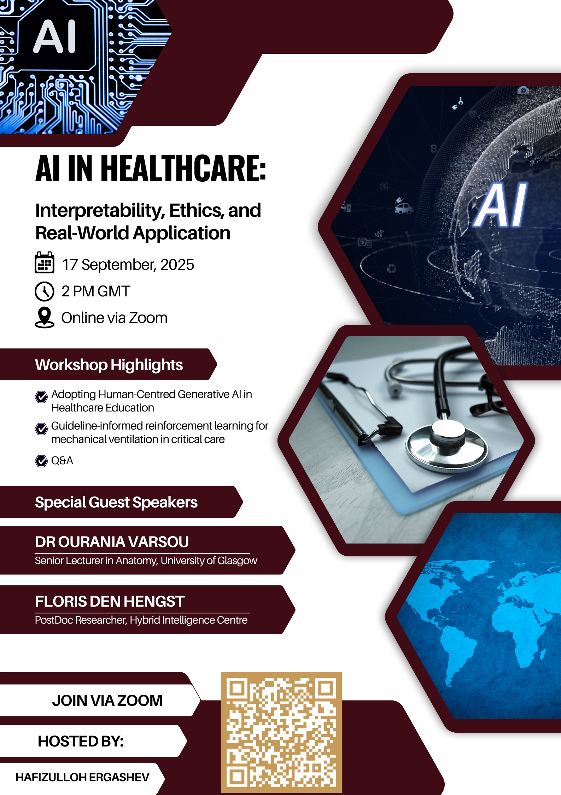

Hey everyone! I would like to invite you to my upcoming conference on 17 September 2025, 14:00 GMT.

## What’s the Conference About?
The presentation, titled "AI in Healthcare: Interpretability, Ethics and Real-World Applications”, will explore how AI can inform clinical decision-making. It will focus on the role of AI in healthcare, its interpretability, and navigating its ethical landscape. Whether you’re a fellow student, a professor, or simply interested in AI, this conference will provide valuable insights into how AI operates behind the scenes and its importance for healthcare.

## Themes to be discussed:

- AI in Medical Imaging
- Predictive Analytics for Patient Outcomes
- Ethical Considerations in AI Healthcare
- AI in Drug Discovery
- AI Interpretability
- Case Studies of AI in Clinical Settings

>Topics are indicative

## Setting

The conference is fully online and organised via Zoom. International students, researchers, and professionals interested in AI and healthcare are invited to participate as speakers and listeners. Attendance is free for all.

## Get Involved

This conference is a chance to see AI in healthcare from a fresh perspective. You’ll see how AI models “think”, why their decisions need to be interpretable, and what ethical challenges we face as we integrate AI into medicine.

### [Register Now](https://form.jotform.com/251888758965079)

 

## FAQ

  
Interested in speaking?

  You can contact me via <a href="mailto:H.Ergashev@wlv.ac.uk">email</a>

  
How to join?

  Registered attendees will receive a Zoom link before the event

  
Will sessions be recorded?

  Yes, they are recorded and shared through this webpage.

<!--  -->
