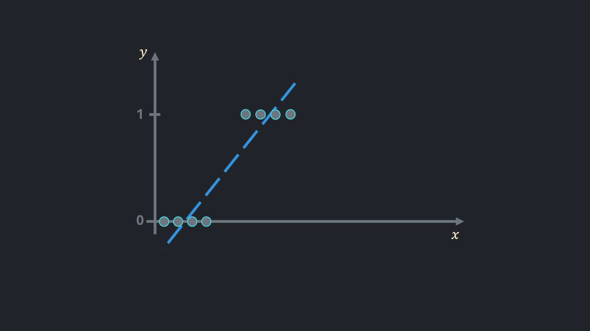
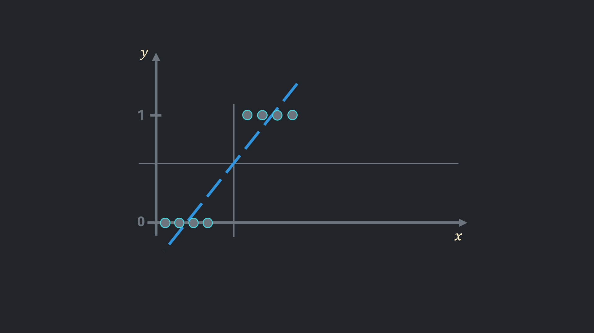
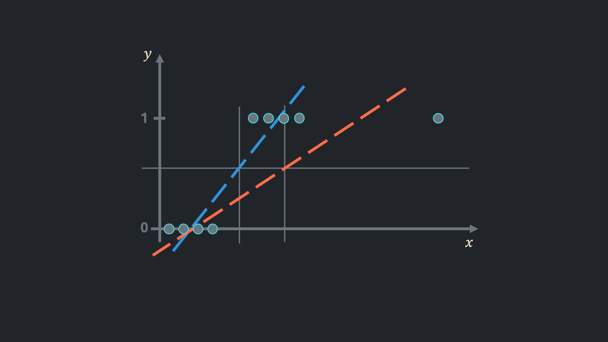
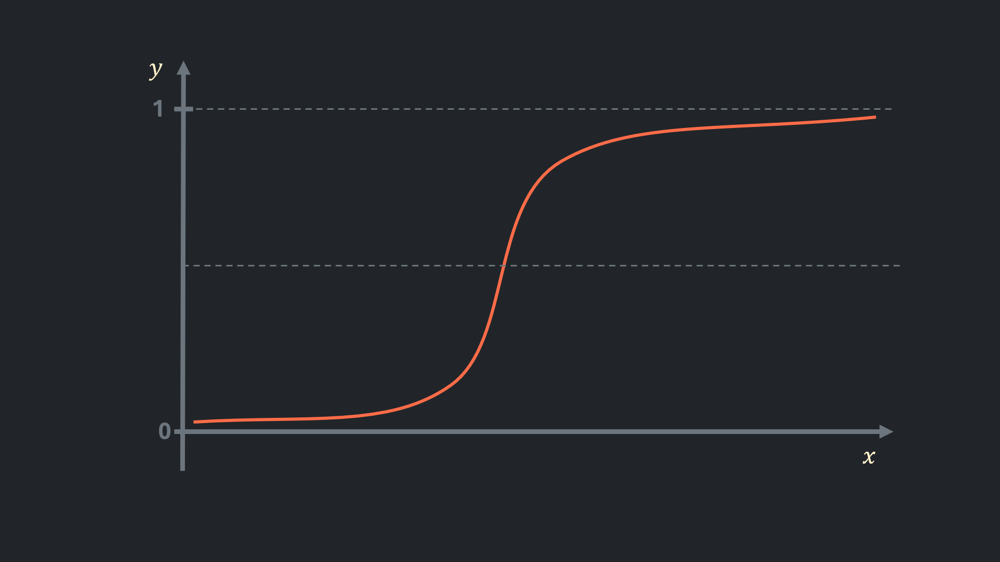
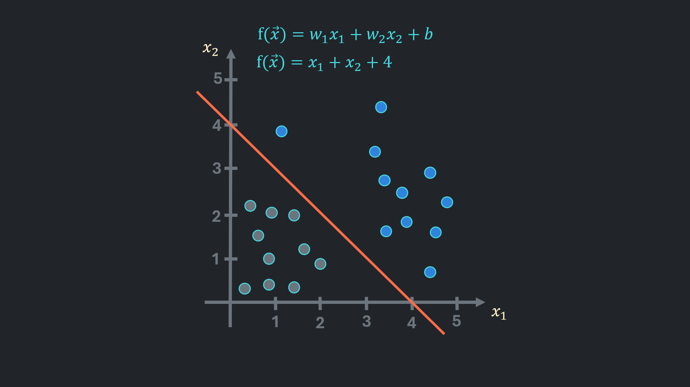
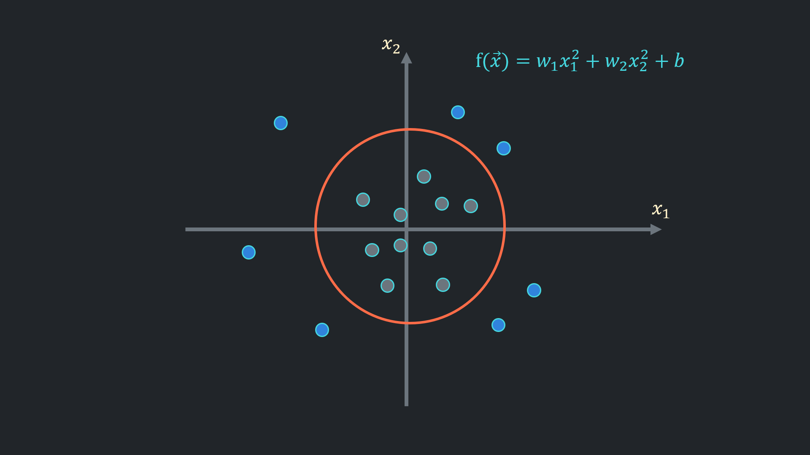

Logistic regression is a statistical method used for binary classification problems. It models a relationship between one or more independent variables and a binary dependent variable (yes/no, true/false, or 0/1). Unlike linear regression, which predicts continuous values, logistic regression predicts a probability that an event occurs. 

## Linear Regression for Binary Classification
If a solution for binary classification was required, linear regression would probably be the first approach taken:

The line closest to the points would look like the blue line shown in the image.

Afterwards, it is possible to set a threshold above which observations are considered to belong to the positive class. For example, an observation would be considered spam if it were an email, or the user would click on an ad if the data were on users. Subsequently, observations below the threshold considered negative class, meaning a user would not click on an ad or a mail is not spam.  
The threshold usually set to 0.5 and in the picture it is horizontal line in the center.

Linear regression seems to work, but adding one outlier changes things considerably: the predictions for the positive class are now significantly worse than before. 
Also, residuals in mean squared error no longer reflect the actual error. 
The outputs are unintuitive. If the model predicts a value of 900, we could say that, according to the model, there is a high chance that the observation belongs to the positive class. But how high is that chance?

Logistic regression addresses these issues.

## Hypothesis Function for Logistic Regression
Hypothesis function of linear regression was $ f(x) = \vec{w} \cdot \vec{x} + b $. It is possible to pass this function as an input for another function which narrows outputs between 0 and 1 in a meaningful way. 

Hypothesis function for logistic regression is:
$$
h(x) = \frac{1}{1+e^{-f(x)}}
$$
graph of which looks similar to the plot below:

High output values result in a value close to 1, while small outputs are converted to a value close to 0. In this way, predictions from logistic regression can be interpreted as the probability that an observation belongs to the positive class. Although these predictions are not actual probabilities, they are highly accurate.

### Decision Boundary

The aforementioned threshold can now be adjusted adaptively. For example, a bank could set a higher threshold for lending money, or an advertisement could be promoted to users who are less likely to click on it.

The threshold referred as __'decision boundary'__ on graph, it is a surface that splits the space into two. In the picture above negative class points are grey and positive class points are blue. 

If polynomial features are used to capture complex relationships, decision boundary could be a circle, ellipse or other freeform shape where points less than 1 are inside the shape.

## Loss Function

Cost function in linear regression measures the mean squred distance between prediction and actual value and expressed as:
$$
    J(w,b) = \frac{1}{m} \sum_{i=1}^{m} ( \frac{1}{2} wx^{(i)} + b - y^{(i)} )^2
$$

It is not suitable for classification, since it does not reflect reality and performs poorly.

In logistic regression instead of distance $ \frac{1}{2} wx^{(i)} + b - y^{(i)} $ __loss__ is measured:
$$
L(x^{(i)}) = \begin{cases} 
-log(wx^{(i)} + b - y^{(i)}), & \mbox{if } y^{(i)} = 1 \\ 
-log(1 - wx^{(i)} + b - y^{(i)}), & \mbox{if } y^{(i)} = 0 
\end{cases}
$$

The loss function returns small values for correct predictions and grater values for errors, even captures how big or small the errors or losses are.

The loss function can be simplified into the following expression:
$$
L(x^{(i)}) = -y^{(i)}log(wx^{(i)} + b - y^{(i)}) - (1-y^{(i)})log(1 - wx^{(i)} + b - y^{(i)})
$$

This way, the calculation of the unsuitable loss is cancelled out by being multiplied by 0.

Cost function for logistic regression now is:
$$
J(\vec{w},b) = \frac{1}{m} \sum_{i=1}^{m}[L(x^{(i)})]
$$

## Gradient Descent
The gradient descent for logistic regression stays as usual, just the derivatives from the cost function are different now:

$$
    w_1 := w_1 - \alpha \times [ \frac{1}{m} \sum_{i=1}^{m} (\vec{w} \cdot \vec{x}^{(i)} + b - y^{(i)})x_1^{(i)} ] \\ 
    \vdots \\ 
    w_n := w_n - \alpha \times [ \frac{1}{m} \sum_{i=1}^{m} ( \vec{w} \cdot \vec{x}^{(i)} + b - y^{(i)} )x_n^{(i)} ]
$$
$$
    b := b - \alpha \times [ \frac{1}{m} \sum_{i=1}^{m} (\vec{w} \cdot \vec{x}^{(i)} + b - y^{(i)}) ]
$$

