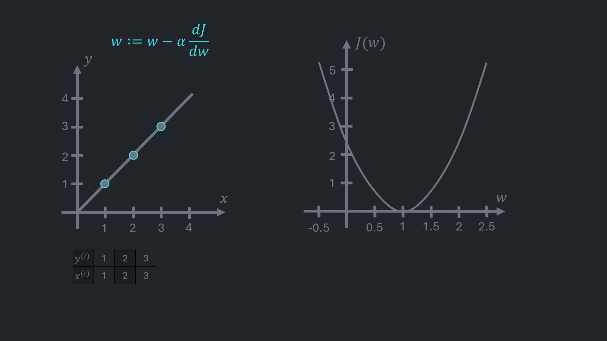
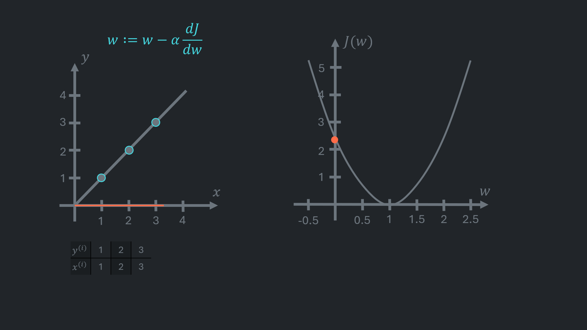
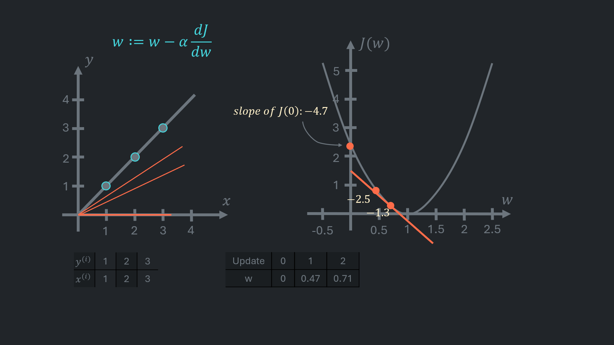
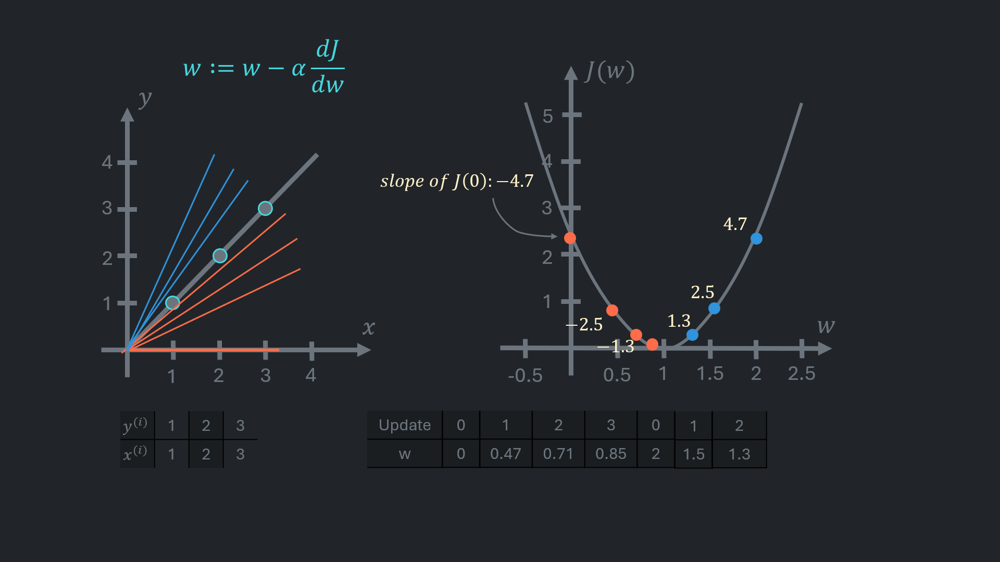
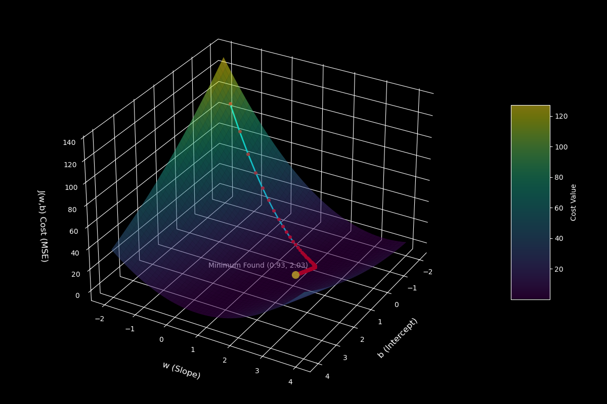

**Univariate linear regression** is a statistical technique that models the relationship between independent variables and single dependent variable.

Such a model can be utilised to predict a dependent variable for a given independent variable.

>The term *'univariate'* simply means 'one variable'

Examples of such relationships might include: 
- Egg size and required boiling time
- Laundry size and required amount of detergent
- Height and weight

This article will examine **simple linear regression**, where the model only includes one independent variable.

The model is expressed as:

$$
\begin{aligned}
  h(x) = wx + b
\end{aligned}
$$

where:
- ***w*** and ***b*** are constant numbers.
- ***x*** is an independent variable (e.g. egg size, laundry size, height).  
    ***x*** is an input for the model. 
    Also called *regressor*, *predictor*, *explanatory variable*, *feature*.
- ***h(x)*** is a dependent variable (e.g. time, amount of detergent, weight). 
    This is the variable that is predicted using the model. 
    The letter 'h' here refers to the term *'hypothesis'*. **Hypothesis** is a possible explanation or a function that describes the given data. A **model**, on the other hand, is a final implementation of a hypothesis that is ready to make predictions.  
    It is often referred to as the *response*, *outcome*, or *target variable*. Also denoted as *y* or *f(x)*.

## What are the roles of the *w* and *b*

Assume that there are multiple pairs of independent (x) and dependent (y) variables marked on a graph. When a *line* that traverses through all points is drawn, it results in a single straight line, as illustrated below: 

This *line* is representative of a graph of a linear function; if each point of that function were marked on the coordinate system, the result would appear as the same line (just infinitely longer).

The point at which the line intersects the vertical axis is referred to as the *'intercept'*. It corresponds to the output value (y or h(x)) when the input (x) equals 0. Intercept is the value of *b* and *b* is not always intuitive. For example, a relatively accurate model that predicts weight based on height could use non-zero value for the intercept (i.e. for the output when height is 0).

*w* is referred to as the *'slope'* because it determines how steep the line is.

To calculate the *slope*, it is necessary to select two points on the *line* and determine the change in y from one point to the other. A similar procedure is followed for x: calculate the change in x from point 1 to point 2. Then, the change in y is divided by the change in x: (| w = \frac{\Delta y}{\Delta x} |)

When the *change in y* is divided by the *change in x*, it will give the change in y for each 1 unit of change in x. In other words, how much y changes if x is increased by 1 (or decreased by 1).  
Slope is a function's changing rate.

Below is an another example of how the slope is calculated:

>$ \frac{y_2 - y_1}{x_2 - x_1} $ and $ \frac{y_1 - y_2}{x_1 - x_2} $ yield the same result

---

## Cost Function

Suppose some observations have been made and plotted on a graph. Given this, the problem that is intended to be solved with linear regression is to find the optimal line or rather the best-fitting linear function that describes the data:

In order to determine whether one function is better than another, an overall error made by the function is used as a criterion. An error on a graph is a distance between the prediction was made and the actual observed value:

>These distances in machine learning are called *'residuals'*. A *residual* is a difference between an observed value and its corresponding predicted value. *Errors* are deviations in predictions from the true values that are often unobservable. 
In supervised learning data is divided into two subsets: **training** (used for optimizing parameters and training the model) and **testing** (used for evaluating model's real-world performance).  
Since errors can be calculated directly from the test set, often distances in the training set are referred to as residuals, while distances in the testing set are called errors.  
For simplicity, the term "error" will be used to refer to both residuals and errors for the remainder of this article.

Erorrs are calculated using the following formula:

$$
\begin{aligned}
\varepsilon^{(i)} = \hat{y}^{(i)} - y^{(i)}
\end{aligned}
$$

where:
- (| i |) is used to denote an index of observations.
- (| \varepsilon^{(i)} |) (epsilon) is an error in the (| i^{th} |) observation. 
- (| \hat{y} |) (y-hat) is a predicted value for corresponding x value. Alternative notation in this article is h(x).
- y is a true observation.

How often a model mistakes is measured by a *cost function*. There are different types of cost functions. Here is the most commonly used cost function *Mean Squared Error (MSE)*:

$$
\begin{aligned}
J(w,b) = \frac {1} {2m} \sum_{i=1}^{m} (\varepsilon^{(i)})^2
\end{aligned}
$$

The Greek letter (| \sum |) (sigma) is used to denote summation. The given formula means "sum all squared errors, then divide the sum by *2m*". As ***m*** is a number of observations, it results in an average squared error. Errors are squared so that negative errors (points above the line yield a negative error) do not reduce the cost function when summarised. It is important to note that more significant errors are penalised to a greater extent. Also, squaring and dividing by 2 makes math calculations more straightforward later.

The cost function can be decomposed into simpler elementary terms:  

$$
\begin{aligned}
    J(w,b) = \frac {1} {2m} \sum_{i=1}^{m} (\varepsilon^{(i)})^2 \allowbreak = \frac {1} {2m} \sum_{i=1}^{m} (\hat{y}^{(i)} - y^{(i)})^2 \allowbreak = \frac {1} {2m} \sum_{i=1}^{m} (h(x^{(i)}) - y^{(i)})^2 \allowbreak = \frac {1} {2m} \sum_{i=1}^{m} (wx^{(i)} + b - y^{(i)})^2
\end{aligned}
$$

---

<link rel="stylesheet" href="https://cdn.jsdelivr.net/npm/@glidejs/glide/dist/css/glide.core.min.css">
<link rel="stylesheet" href="https://cdn.jsdelivr.net/npm/@glidejs/glide/dist/css/glide.theme.min.css">

  

    <ul class="glide__slides">
      <li class="glide__slide">
          
          

            Consider a dataset with independent values x (| \in |) {1, 2, 3} and dependent values y (| \in |) {1, 2, 3}. The data points are marked on the left coordinate system in the above figure.    
            The cost function is plotted on the right side. The horizontal axis represents slopes (w) of hypothesis functions, while the vertical axis corresponds to the result of the cost function (J) for a matching slope.
          
 
      </li>
      <li class="glide__slide">
          
          

            For simplicity, it is assumed here that b = 0. In this case, the result of the cost function of hypothesis h(x) = -(1/2)x is as follows:  
            $$
            J(w) = \frac{1}{2m} \sum_{i=1}^{m}(wx^{(i)} + 0 - y^{(i)})^2 \allowbreak = \frac{1}{2 \times 3} \allowbreak \times (( - \frac{1}{2} \times 1 - 1)^2 \allowbreak + ( - \frac{1}{2} \times 2 - 2)^2 \allowbreak + ( - \frac{1}{2} \times 3 - 3)^2) =  \frac{1}{6} \allowbreak \times ( 2.25 + 9 + 20.25 ) = \frac{31.5}{6} = 5.25
            $$
          

      </li>
      <li class="glide__slide">
          
          

            The next assumed slope is 0; Therefore, the hypothesis becomes h(x) = 0x + 0; y is zero for any value of x:
            $$
              J(w) = \frac{1}{2m} \sum_{i=1}^{m}(wx^{(i)} - y^{(i)})^2 = \frac{(0 \cdot 1-1)^2 + (0 \cdot 2-2)^2 + (0 \cdot 3-3)^2}{ 2 \times 3} = \frac{14}{6} \approx 2.3 
            $$
          

      <!-- </li>
      <li class="glide__slide">
          
      </li> -->
      <li class="glide__slide">
          
          

            You can attempt to calculate the cost for the hypothesis h(x) = (1/2)x, which was calculated in the background. The cost is expected to be a little smaller than 0.6  
            The next presented hypothesis is h(x) = x:
            $$
              J(w) = \frac{1}{2m} \sum_{i=1}^{m}(wx^{(i)} - y^{(i)})^2 = \frac{(1 \times 1-1)^2 + (1 \times 2-2)^2 + (1 \times 3-3)^2}{ 2 \times 3} = \frac{0}{6} = 0 
            $$
          

      </li>
      <li class="glide__slide">
          
          

            The next hypothesis is h(x) = (3\2)x:
            $$
              J(w) = \frac{1}{2m} \sum_{i=1}^{m}(wx^{(i)} - y^{(i)})^2 = \frac{1}{ 2 \times 3} \times ((\frac{3}{2} \times 1-1)^2 + (\frac{3}{2} \times 2-2)^2 + (\frac{3}{2} \times 3-3)^2) = \frac{0.25 + 1 + 2.25}{6} \approx 0.583
            $$
          

      </li>
      <li class="glide__slide">
          
          

            After corresponding calculations for slopes 2 and 2.5, the final graph will look like the one above.
          

      </li>
      <li class="glide__slide">
          
          

            In the case of the results of the cost function being plotted on a graph for each slope value between -0.5 and 2.5, the result would be a very similar (or even identical) 'U'-shaped line.
          

          
↓

          
↓

      </li>
    </ul>
  

  

    <button class="glide__arrow glide__arrow--left px-2 py-1 bg-transparent border border-gray-200 text-white hover:border-white" data-glide-dir="<">Prev</button>
    <button class="glide__arrow glide__arrow--right px-2 py-1 bg-transparent border border-gray-200 text-white hover:border-white" data-glide-dir=">">Next</button>
  

<!--  -->

---

In simple linear regression the optimal line that best fits the data is determined by minimising the cost function. While it is straightforward to identify this line in simple linear regression by brute force, this becomes impractical when there are more than two independent variables; each independent variable requires an additional axis, or dimension, on a graph. Although computers can visualise such graphs, it is impossible to understand what exactly is being plotted.  
One of the methods used to minimise the cost function is called *'gradient descent'*.

## Gradient Descent

**Gradient descent** is an iterative optimisation algorithm for minimising a differentiable function. 
It requires:
1. Calculate the function's gradient. The resulting vector of partial derivatives is referred to as the *'gradient'*.
2. Update parameters based on the gradient.
3. Repeat until convergence (very small change in cost or gradient).

Again the intercept b is 0 for now. For the cost function:
$$
J(w) = \frac {1} {2m} \sum_{i=1}^{m} (wx^{(i)}-y^{(i)})^2
$$

the derivative is the following:

$$
\frac{dJ}{dx} = \frac{1}{m} \sum_{i=1}^{m} (wx^{(i)}-y^{(i)})x^{(i)}
$$

Since taking derivative is applying the right formulas, there is no value in presenting the exact path from the cost function. So I didn't.

The update rule is:

$$
w_{new} := w - \alpha \times \frac{dJ}{dx}
$$

where (| \alpha |) is referred to as a **'learning rate'**. It is just a small number that scales the derivative. It is usually set to 0.01, when features are scaled.

---

  

    <ul class="glide__slides">
      <li class="glide__slide">
          
          

            The dataset is the same.  
          

      </li>
      <li class="glide__slide">
          
          

            For better understanding, the cost function is plotted on the graph.
          

      </li>
      <li class="glide__slide">
          
          

            Usually starting hypothesis slope is 0.
          

      </li>
      <li class="glide__slide">
          
          

            Suppose the cost is calculated for another hypothesis. The slope of this hypothesis differs so little from the previous one that the resulting costs are almost identical. Over this interval, the cost function behaves as a linear function.  
            A line that connects these costs is plotted on a graph.  
            This line is called a <i>'tangent line'</i>. The <b>tangent line</b> is a line that just touches a curve without crossing it. 
            You can find out more about tangent line in <a href="https://youtu.be/O_cwTAfjgAQ?si=KSVlArnSl_gwfovZ" target="_blank">this YouTube video</a>.
           
          

      </li>
      <li class="glide__slide">
          
          

            Drawing the tangent line allows a direct calculation of its slope. In other words, the rate of change of the cost function can be defined for each value of w.
          

      </li>
      <li class="glide__slide">
          
          

            Calculating the derivative gives the rate of change for a given w:
            $$
            \frac{dJ}{dx} = \frac{1}{m} \sum_{i=1}^{m} (wx^{(i)}-y^{(i)})x^{(i)} = \frac{1}{3} \times ((0 \cdot 1 - 1) \cdot 1 +  (0 \cdot 2 - 2) \cdot 2 + (0 \cdot 3 - 3) \cdot 3) = \frac{1}{3} \times (-1 - 4 -9) \approx -4.7 
            $$
            Apply the update rule with the learning rate 0.01:
            $$
            w_{new} := w - \alpha \times \frac{dJ}{dw} \Rightarrow w = 0 - 0.1 \times (-4.7) = 0 + 0.47
            $$
          

      </li>
      <li class="glide__slide">
          
          

            The second iteration:
            $$
            \frac{dJ}{dx} = \frac{1}{m} \sum_{i=1}^{m} (wx^{(i)}-y^{(i)})x^{(i)} = \frac{1}{3} \times ((0.47 \cdot 1 - 1) \cdot 1 +  (0.47 \cdot 2 - 2) \cdot 2 + (0.47 \cdot 3 - 3) \cdot 3) = \frac{1}{3} \times (-0.53 -2.12 -4.77) \approx -2.47
            $$
            $$
            w_{new} := w - \alpha \times \frac{dJ}{dw} \Rightarrow w = 0.47 - 0.1 \times (-2.5) = 0.47 + 0.247 = 0.717
            $$
          

      </li>
      <li class="glide__slide">
          
          

            Other iterations are calculated in the same way.
          

      </li>
      <li class="glide__slide">
          
          

            As the gradient descent approaches the minimum point, the rate of change of the cost function (or the derivative) becomes smaller and the update steps become smaller.
          

      </li>
      <li class="glide__slide">
          
          

            On the other hand, when a parameter is greater than a minimum point, the slope of the tangent line is positive. Updating w, in this case, makes it smaller:
            $$
            \frac{dJ}{dx} = \frac{1}{m} \sum_{i=1}^{m} (wx^{(i)}-y^{(i)})x^{(i)} = \frac{1}{3} \times ((2 \cdot 1 - 1) \cdot 1 +  (2 \cdot 2 - 2) \cdot 2 + (2 \cdot 3 - 3) \cdot 3) = \frac{1}{3} \times (1 + 4 + 9) \approx 4.7 
            $$
            Update:
            $$
            w_{new} := w - \alpha \times \frac{dJ}{dw} \Rightarrow w = 2 - 0.1 \times (4.7) = 2 - 0.47 \approx 1.5
            $$
          

      </li>
      <li class="glide__slide">
          
          

            Just to be clear, when training models these calculations are never made by a human nowadays.
          

      </li>
      <li class="glide__slide">
          
          

            The iterations repeated until convergence. There are 2 types of convergence: gradient-based and cost-based.  
            The derivative or the cost are monitored, if derivative is very close to 0 or the cost difference between iterations are too small, the parameters considered as converged.  
            Sometimes, they are combined.   
            The convergence threshold typically in the range of (| 10^{-4} |) to (| 10^{-8} |).
          

      </li>
      <li class="glide__slide">
          
          

            At minimum point tangent line is horizontal and its slope is 0.
          

      </li>
    </ul>
  

  

    <button class="glide__arrow glide__arrow--left px-2 py-1 bg-transparent border border-gray-200 text-white hover:border-white" data-glide-dir="<">Prev</button>
    <button class="glide__arrow glide__arrow--right px-2 py-1 bg-transparent border border-gray-200 text-white hover:border-white" data-glide-dir=">">Next</button>
  

---

For non-zero intercept one more dimention should be introduced on the cost function's graph:

It is the cost function's surface for a data for which best fit is y = 2x + 1. 
Red points here represent each combination of slope and intercept and corresponding cost.

Since there are two values on which cost function depends, for the cost function: 
$$
J(w, b) = \frac{1}{2m} \sum_{i=1}^{m} (wx^{(i)} + b - y^{(i)})^2
$$

should be taken the partial derivatives:

1. $$ \frac{\partial J}{\partial w} = \frac{1}{m} \sum_{i=1}^{m} (wx^{(i)} + b - y^{(i)})x^{(i)} $$
2. $$ \frac{\partial J}{\partial b} = \frac{1}{m} \sum_{i=1}^{m} (wx^{(i)} + b - y^{(i)}) $$

The parameters of hypothesis should be updated simultaneously:
1. $$ w_{new} := w - \alpha \times \frac{dJ}{dw} $$
2. $$ b_{new} := b - \alpha \times \frac{dJ}{db} $$
