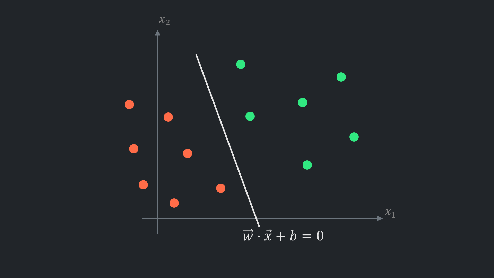
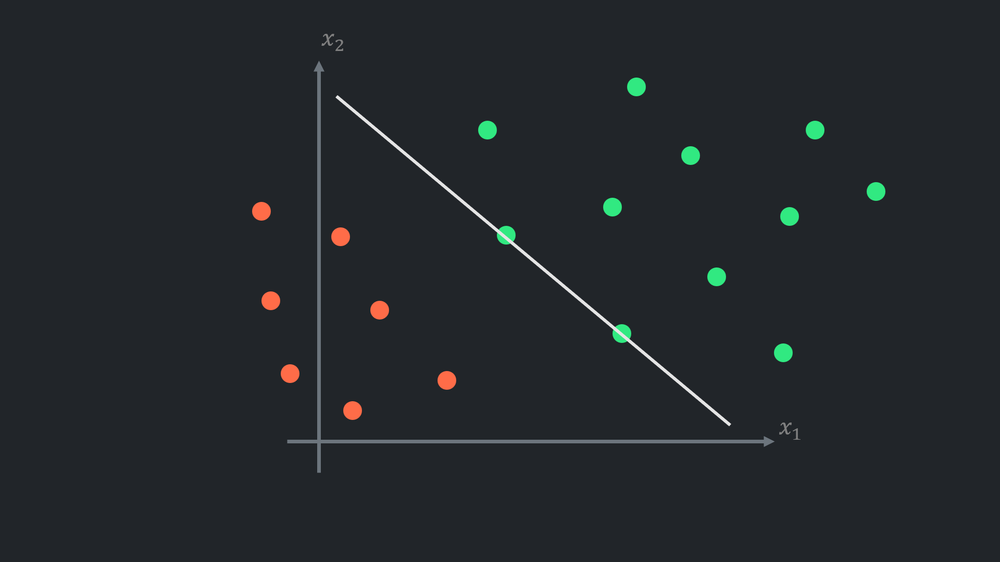
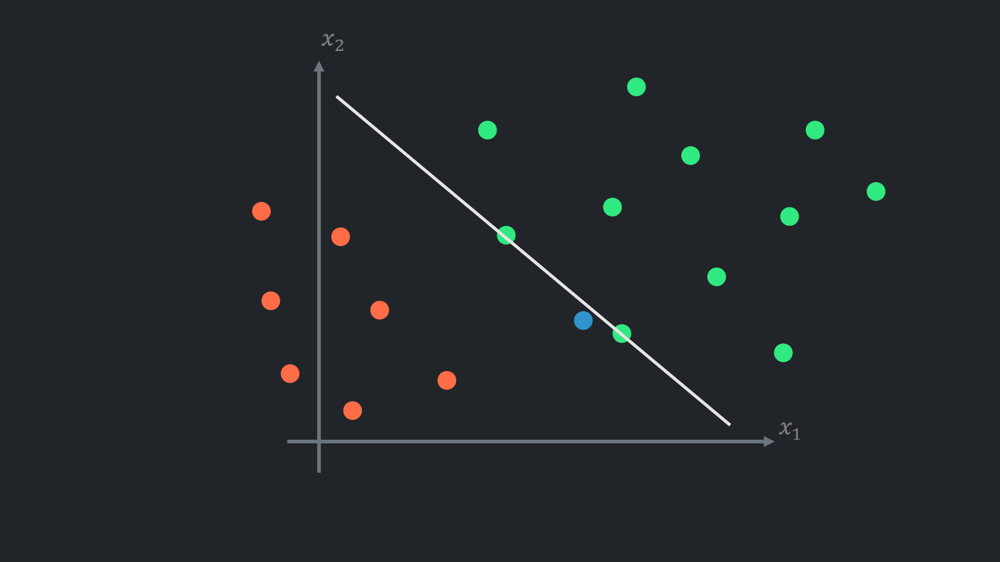
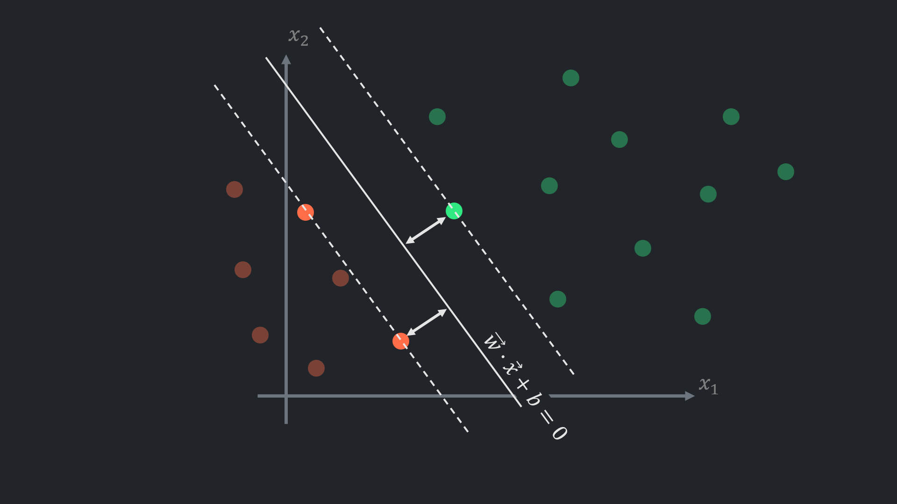
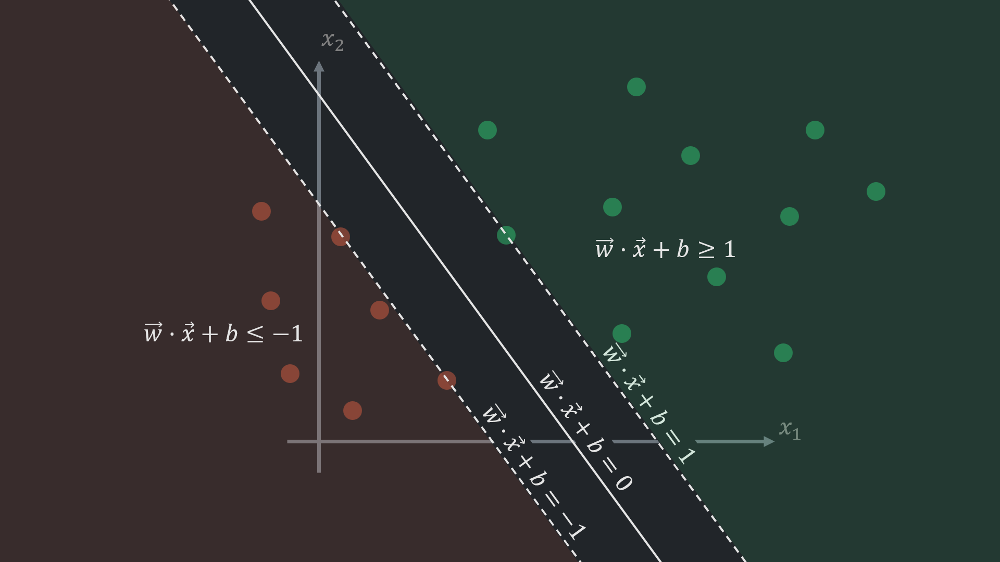
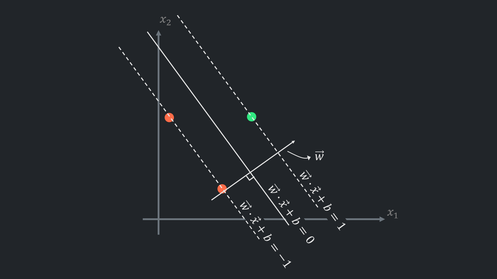
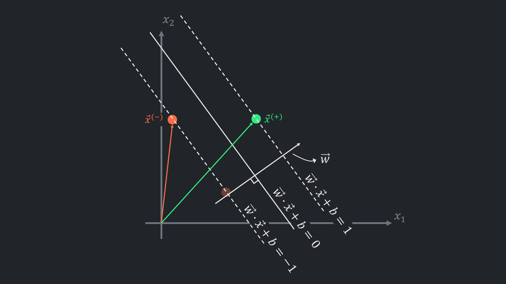
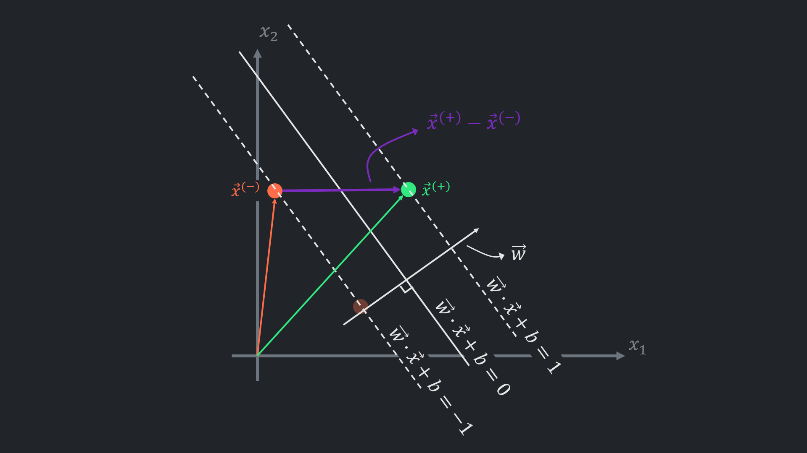
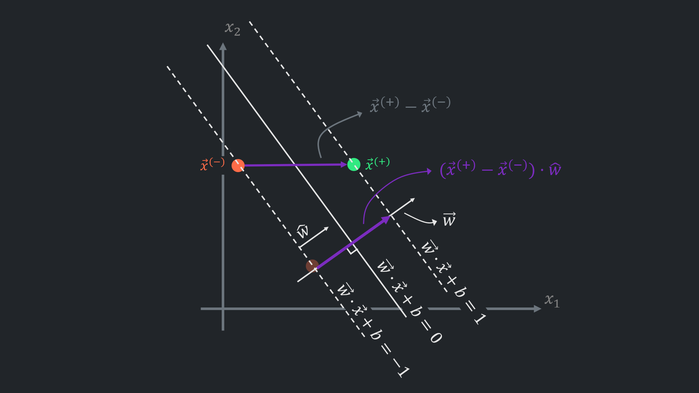
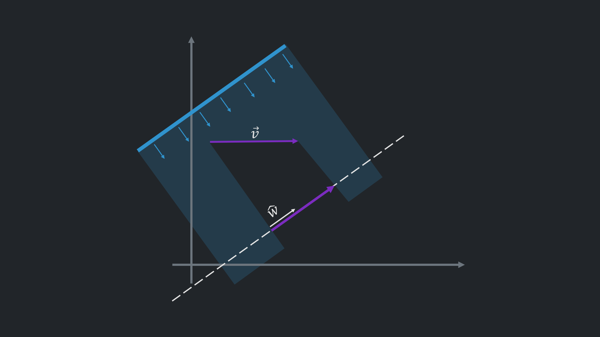

**Previous article:** [Logistic Regression](/blogs/logistic-regression/)

**Support vector machines (SVM)** is a supervised learning algorithm that can be used for both classification and regression. SVMs were primarily developed for binary classification, which is the focus of this article, but extensions for multi-class classification also exist.

---

In a previous post on logistic regression, a decision boundary - a hyperplane that separates data points in feature space - was briefly mentioned.  
Decision boundary is defined as $ \vec{w} \cdot \vec{x} + b = 0 $ which is the general form for any hyperplane.

---

Logistic regression, when classes are balanced (there are similar number of examples in each class) and there are no outliers, positions the hyperplane well. Otherwise, the class with more examples or outliers 'pulls' the hyperplane.

---

This creates problems with unseen data in the future, so the model may not handle even small fluctuations.

---

In the case of logistic regression, this problem can be partially compensated for by changing the classification threshold.  
The classification boundary is a hyperplane that overlaps with the decision boundary when the threshold is set to $0.5$. Lowering the threshold shifts the classification boundary perpendicular to the negative class, and vice versa.  
However, this is not the purpose of the threshold, and the resulting hyperplane is not ideal.

---

SVM proposes placing the hyperplane between the classes as far as possible. This ensures that data points are classified fairly based on how close they are to the classes.

---

The margin hyperplanes (the dashed lines in the picture above) for SVM are defined as:

$$ \vec{w} \cdot \vec{x} + b = \pm 1 $$

They also called **hard margin** (soft margin will be covered in the next post).

The margin hyperplanes could be set to any other arbitrary positive number, for example to $c$: $ \vec{w} \cdot \vec{x} + b = \pm c $ , divide the both sides of the equation\s by $c$ : $ \frac{\vec{w}}{c} \cdot \vec{x} + \frac{b}{c} = \pm 1 $  
So $ c $ only scales $ \vec{w} $ and $ b $ meaning, geometrically, there is no difference, even though it scales the **functional margin**, which measures how far a data point is from the hyperplane. **Functional margin**: $ \vec{w} \cdot \vec{x}^{(i)} + b $ is an output of the model for a given data point $ \vec{x}^{(i)} $. This output determines whether the data point should be classified as a positive or negative sample (positive if greater than 0, and vice versa). Scaling functional margin doesn't affect how model performs

---

For any hyperplane $ \vec{w} \cdot \vec{x} + b = 0 $ vector $ \vec{w} $ is orthogonal (perpendicular) to the hyperplane. This property will be utilised later.

---

If the decision boundary is placed ideally, there will be at least two points on the margin hyperplanes.

---

Subtracting one vector from another creates a new vector: $ \vec{x}^{(+)} - \vec{x}^{(-)} $ that connects the margin hyperplanes.

---

The resultant vector ($ \vec{x}^{(+)} - \vec{x}^{(-)} $) multiplied by **unit vector** $ \hat{w} $ will yield the length of the projected vector. Since $ \vec{w} $ orthogonal to the hyperplane and margin hyperplanes, this length is the distance between the margin hyperplanes. 
Vector multiplications geometrically interpreted as projecting one vector onto another (more details will be below). 
Unit vector $ \hat{w} $ is scaled down vector $ \vec{w} $, so that the length of the vector now is 1.

---

As I mentioned, vector multiplication can be interpreted geometrically as a projection. For example, there are two vectors $ \vec{v} $ and $ \hat{w} $ and a hyperplane parallel to $ \hat{w} $ was created for easier understanding. Lights coming from an angle perpendicular to $ \hat{w} $ would create a shadow, as demonstrated above. 
The same idea sometimes articulated as the closest vector to $ \vec{v} $ on the hyperplane. 
Slightly different view point is $ \hat{w} \cdot \vec{v} $ shows how far $ \vec{v} $ goes in the direction of $ \hat{w} $.

On its own $ \hat{w} \cdot \vec{v} $ produces a scalar, which is a length $ l $ of the projection. The projection of $ \vec{v} $ onto $ \hat{w} $ can be constructed by multiplying the unit vector with the resultant length: $ \hat{w} \cdot l $

Unit vector in the direction of any vector can be calculated by scaling down the components of a vector by its length:

$$ \hat{v} = \frac{\vec{v}}{||\vec{v}||} = \frac{\begin{bmatrix} v_{1} & v_{2} & \cdots & v_{n}  \end{bmatrix}}{\sqrt{v_{1}^2 + v_{2}^2 + \cdots + v_{n}^2}} $$

---

Now, why $ \vec{x}^{(+)} - \vec{x}^{(-)} \cdot \hat{w} $ calculates the distance between hard margin hyperplanes should be clearer. Expanding values in the expression allows to identify what are the values that affect the margin:

It is guaranteed that the $ \vec{x}^{(+)} $ is on the positive margin hyperplane (from the beginning the $ \vec{x}^{(+)} $ was treated as a point on the hyperplane). This allows to substitute $ \vec{x} $ with $ \vec{x}^{(+)} $ in the hyperplane formula: 
&emsp;&emsp; $ \vec{w} \cdot \vec{x}^{(+)} + b = 1 $ 
&emsp;&emsp; $ \rightarrow \vec{x}^{(+)} = \frac{1-b}{\vec{w}} $

Analogically, $ \vec{x}^{(-)} $ can be substituted with: 
&emsp;&emsp; $ \vec{w} \cdot \vec{x}^{(-)} + b = -1 $ 
&emsp;&emsp; $ \rightarrow \vec{x}^{(-)} = -\frac{1+b}{\vec{w}} $

The unit vector is expanded as: 
$ \hat{w} = \frac{\vec{w}}{||\vec{w}||} $

So, $ \vec{x}^{(+)} - \vec{x}^{(-)} \cdot \hat{w} $ becomes:

$$ \left( \frac{1-b}{\vec{w}} - \left( -\frac{1+b}{\vec{w}} \right) \right) \cdot \frac{\vec{w}}{||\vec{w}||}  $$

The vectors $ \vec{w} $ cancel out:

$$ \left( 1-b + 1+b \right) \cdot \frac{1}{||\vec{w}||}  $$

The conclusion is straightforward. The margin is inversely proportional to the length of the vector $\vec{w}$ : $\frac{2}{||\vec{w}||}$. So, the objective now is maximising this expression. However, in SVM, for mathematical convenience, another equivalent problem is solved:

$$ \text{max}\left(\frac{2}{||\vec{w}||} \right) \Longleftrightarrow \text{min}\left(||\vec{w}||\right) \Longleftrightarrow \boxed{\text{min}\left(\frac{1}{2} ||\vec{w}||^{2} \right)} $$

Other than the new minimisation problem there are constraints, that enforce the predictions $h(x)=\vec{w} \cdot \vec{x}+b$ to be outside of the margin space:

$$
\vec{w} \cdot \vec{x}^{(i)} + b \geq 1 \quad \text{for} \quad  y^{(i)}=1 \quad \text{(for positive class examples)} \\
\vec{w} \cdot \vec{x}^{(i)} + b \leq -1 \quad \text{for} \quad  y^{(i)}=-1 \quad \text{(for negative class examples)}
$$

If left and right sides of the constraints multiplied by $ y^{(i)} $, both expression will have the same look, which simplifies the task:
$$ y^{(i)} \left( \vec{w} \cdot \vec{x}^{(i)} + b \right) \geq 1 $$

Once there are an optimisation problem $\left( \text{min}\left(\frac{1}{2} ||\vec{w}||^{2} \right) \right)$ and constraints  $ \left( y^{(i)} \left( \vec{w} \cdot \vec{x}^{(i)} + b \right) \geq 1 \right)$, it is possible to apply method called Lagrange multipliers with Karush-Kuhn-Tucker (KKT) conditions and find the minimum. 

$ \longrightarrow $ For this, each constraint written in required form:
$$ g_i(\vec{w},b)=1-y^{(i)}(\vec{w}\cdot\vec{x}^{(i)}+b) \leq 0 $$

$ \longrightarrow $ The *Lagrangian* formed:
$$ \mathcal{L}(\vec{w},b,\alpha) = \frac{1}{2}||\vec{w}||^{2} + \sum_{i=1}^{m}\alpha_i \left(1-y^{(i)}\left(\vec{w}\cdot\vec{x}^{(i)}+b\right)\right), \quad \alpha_i \geq 0 $$

$ \longrightarrow $ KKT conditions applied:  

$ \rightarrow $ Stationarity w.r.t. $ w $ :
$$ \nabla_w \mathcal{L} = w - \sum_{i=1}^{m} \alpha_i y^{(i)} x^{(i)} = 0 \quad \Rightarrow \quad w = \sum_{i=1}^{m} \alpha_i y^{(i)} x^{(i)} $$

$ \rightarrow $ Stationarity w.r.t. $ b $ :
$$ \frac{\partial \mathcal{L}}{\partial b} = - \sum_{i=1}^{m} \alpha_i y^{(i)} = 0 \quad \Rightarrow \quad \sum_{i=1}^{m} \alpha_i y^{(i)} = 0  $$ 

$ \rightarrow $ Complementary slackness:
$$ \alpha_i \cdot g_i(\vec{w},b) = \alpha_i \left(1-y^{(i)}(\vec{w}\cdot\vec{x}^{(i)}+b) \right) = 0, \text{ for all } i $$

$ \longrightarrow $ And plugging the resultant values back to Lagrangian yields the dual problem:
$$ \max_{\alpha} = \sum_{i=1}^{m}\alpha_i - \frac{1}{2} \sum_{i=1}^{m}\sum_{j=1}^{m} \alpha_i\alpha_j y^{(i)}y^{(j)}\left(\vec{x}^{(i)} \cdot \vec{x}^{(j)} \right) $$
subject to
$$ \alpha_i \geq 0, \quad \sum_{i=1}^{m} \alpha_i y^{(i)} = 0 $$
